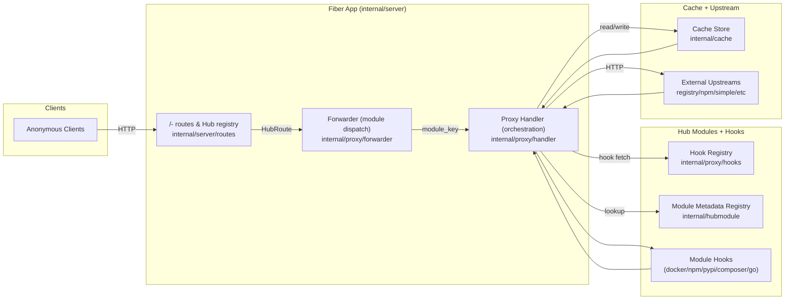

# any-hub Architecture (Mermaid)

- Requests flow from clients into Fiber routes, which use the Hub registry to select a `HubRoute`.
- Forwarder chooses the module handler based on `module_key`; the proxy handler orchestrates cache lookup/write and upstream streaming.
- Module-specific logic (path normalization, upstream resolution, rewrites, cache policy) lives in Hooks per module; hook registry enforces registration.
- Cache store manages local filesystem layout, while upstreams provide original artifacts/content.
